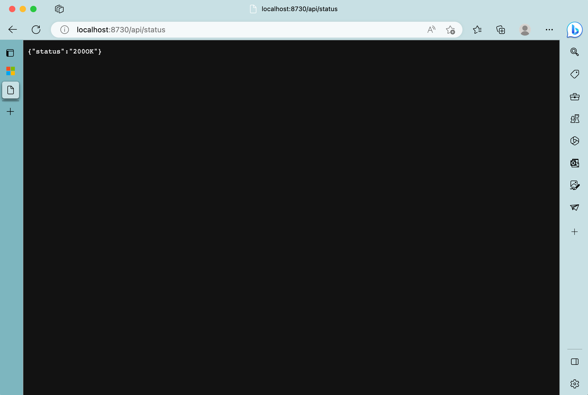
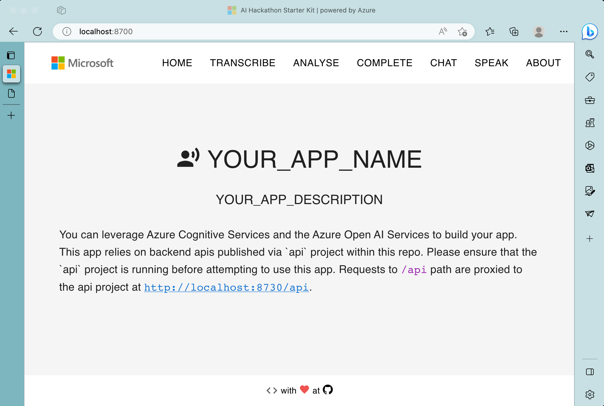

<a name="readme-top"></a>

<!-- PROJECT SHIELDS -->
<!--
*** Using markdown "reference style" links for readability.
*** Reference links are enclosed in brackets [ ] instead of parentheses ( ).
*** See the bottom of this document for the declaration of the reference variables
*** for contributors-url, forks-url, etc. This is an optional, concise syntax you may use.
*** https://www.markdownguide.org/basic-syntax/#reference-style-links
-->
[![Contributors][contributors-shield]][contributors-url]
[![Forks][forks-shield]][forks-url]
[![Stargazers][stars-shield]][stars-url]
[![Issues][issues-shield]][issues-url]
[![MIT License][license-shield]][license-url]
[![LinkedIn][linkedin-shield]][linkedin-url]


<!-- PROJECT LOGO -->
<br />
<div align="center">
  <h3 align="center">
    AI Hackathon Starter Kit
  </h3>

  <p align="center">
    powered by
    <br />
    <a href="https://github.com/rohit-lakhanpal/ai-hackathon-starter-kit">
    
  </a>
    <br />
    <a href="https://github.com/rohit-lakhanpal/ai-hackathon-starter-kit"><strong>Explore the docs »</strong></a>
    <br />
    <br />
    <a target="_blank" rel="noopener noreferrer" href="https://ai-hackathon-starter-kit-dev.azurewebsites.net/">View Demo</a>
    ·
    <a href="https://github.com/rohit-lakhanpal/ai-hackathon-starter-kit/issues">Report Bug</a>
    ·
    <a href="https://github.com/rohit-lakhanpal/ai-hackathon-starter-kit/issues">Request Feature</a>
  </p>
</div>


<!-- TABLE OF CONTENTS -->
<details>
  <summary>Table of Contents</summary>
  <ol>
    <li>
      <a href="#about-the-project">About The Project</a>
      <ul>
        <li><a href="#built-with">Built With</a></li>
      </ul>
    </li>
    <li>
      <a href="#getting-started">Getting Started</a>
      <ul>
        <li><a href="#prerequisites">Prerequisites</a></li>
        <li><a href="#installation">Installation</a></li>
      </ul>
    </li>
    <li><a href="#usage">Usage</a></li>
    <li><a href="#roadmap">Roadmap</a></li>
    <li><a href="#contributing">Contributing</a></li>
    <li><a href="#license">License</a></li>
    <li><a href="#contact">Contact</a></li>
    <li><a href="#acknowledgments">Acknowledgments</a></li>
    <li><a href="#references">References</a></li>
  </ol>
</details>


<!-- ABOUT THE PROJECT -->
## About The Project

[](https://www.youtube.com/watch?v=qgCQMrbXGQA)


Welcome to the AI Hackathon Starter Kit! This project has been created to make AI accessible and easy for everyone. Whether you are a beginner with no prior experience or an experienced developer, this starter kit is designed to help you incorporate AI into your apps quickly and easily.

The AI Hackathon Starter Kit has many features that make it an excellent tool for anyone looking to work with AI. 

The tool showcases how to work with the following use cases:
- Transcription (Speech to Text)
- Text Analytics
  - Sentiment Analysis
  - Entity Recognition
  - Special Entity Recognition for Healthcare
  - Pii Recognition
- Speak (Text to Speech)
- Natural Language Generation


This kit removes the complexity of working with AI and allows you to focus on building your app. We have added placeholders for you to add your code and get started quickly. Search for the text "`NOTE TO DEVELOPER: YOUR_MAGIC_GOES_HERE`" to find the placeholders.

```js
var timeoutId = setTimeout(() => {
    /**
     * ***************************************
     * NOTE TO DEVELOPER: YOUR_MAGIC_GOES_HERE
     * ***************************************
     * This is where you would do interesting things 
     * with the words that were spoken.
     */
    setWordsSpoken((prev:string) => {
        return prev + " " + event.privText;
    });
}, wordOffset);
```


<p align="right">(<a href="#readme-top">back to top</a>)</p>


### Built With

These usecases leverage the following technologies:
- Azure Cognitive Services for:
  - Speech [Learn More](https://learn.microsoft.com/en-us/azure/cognitive-services/speech-service/overview)
  - Language [Learn More](https://learn.microsoft.com/en-us/azure/cognitive-services/language-service/language-detection/overview)
- Azure Open AI [Learn More](https://learn.microsoft.com/en-us/azure/cognitive-services/openai/overview)

Major cloud technologies/frameworks/libraries are listed here:
* [![Azure][azure.com]][azure-url]
* [![OpenAI][openai.com]][openai-url]
* [![Node.js][Node.js]][Node-url]
* [![Express][Express.js]][Express-url]
* [![Material][mui.com]][mui-url]
* [![React][React.js]][React-url]

<p align="right">(<a href="#readme-top">back to top</a>)</p>


<!-- GETTING STARTED -->
## Getting Started

To get a local copy up and running follow these simple example steps.

### Prerequisites

#### Create Cloud Services

To use this starter kit, you will need the following cloud services:
1. Create a free Azure account [here](https://azure.microsoft.com/en-us/free/).
2. Create a free OpenAI account [here](https://beta.openai.com/).
3. Sign up for the Azure Cognitive Services Speech API [here](https://azure.microsoft.com/en-us/try/cognitive-services/?api=speech-services).
4. Sign up for the Azure Cognitive Services Language API [here](https://azure.microsoft.com/en-us/try/cognitive-services/?api=language-services).
5. Sign up for the Azure Cognitive Services OpenAI API [here](https://azure.microsoft.com/en-us/try/cognitive-services/?api=openai).

To learn more about setting up your cloud resources, please visit see [cloud-setup](docs/cloud-setup.md).

#### Setup Local Development Environment

1. [Node.js](https://nodejs.org/en/download/): Check if you have Node.js installed by running the following command in your terminal:
    ```sh
    node -v
    ```
    > Please validate that the version is 18.15 or higher.
1. [Npm](https://www.npmjs.com/get-npm): Check if you have npm installed by running the following command in your terminal:
    ```sh
    npm -v
    ```
    > Please validate that the version is 9.6 or higher.
1. [Git](https://git-scm.com/downloads)
1. [Visual Studio Code](https://code.visualstudio.com/download)

#### Prepare your environment

A sample environment file has been provided for you to use. You will need to update the values in the file with your own values.

1. Open up a text editor and get a copy of the evnironment file from: 
  [github.com/rohit-lakhanpal/ai-hackathon-starter-kit/blob/main/src/api/.env-sample](https://github.com/rohit-lakhanpal/ai-hackathon-starter-kit/blob/main/src/api/.env-sample)
  
1. Update the values in the `.env` file with your own values. 

    ```env
    PORT=8730    
    APP_NAME="YOUR_APP_NAME"
    APP_DESCRIPTION="YOUR_APP_DESCRIPTION"
    APP_REPOSITORY_OPTIONAL="YOUR_APP_REPOSITORY_URL (Optional. If you remove this line, it defaults to this repository's url.)"
    APP_LOGO_OPTIONAL="YOUR_APP_LOGO_URL (Optional. If you can remove this line, it defaults to the Microsoft logo.)"
    APP_FAVICON_OPTIONAL="YOUR_APP_FAVICON_URL (Optional. You can remove this line, it defaults to the Microsoft favicon.)"
    LANGUAGE_KEY="YOUR_AZURE_LANGUAGE_KEY"
    LANGUAGE_REGION="YOUR_AZURE_LANGUAGE_REGION"
    LANGUAGE_ENDPOINT_URL="YOUR_AZURE_LANGUAGE_ENDPOINT_URL"
    SPEECH_KEY="YOUR_AZURE_SPEECH_KEY"
    SPEECH_REGION="YOUR_AZURE_SPEECH_REGION"
    SPEECH_ENDPOINT_URL_OPTIONAL="YOUR_AZURE_SPEECH_ENDPOINT_URL (Optional. You can remove this line if you don't have a custom speech endpoint url.)"
    OPENAI_TYPE="Must be either openai or azure"
    OPENAI_KEY="YOUR_OPENAI_KEY"
    OPENAI_AZURE_KEY="YOUR_OPENAI_AZURE_KEY"
    OPENAI_AZURE_BASE_URL="[eg. https://[your-deployment-name].openai.azure.com/]"
    OPENAI_AZURE_API_VERSION_OPTIONAL="2023-03-15-preview"
    OPENAI_AZURE_MODELS_TEXT="YOUR_MODEL_DEPLOYMENT_NAME_FOR_text-davinci-003"
    OPENAI_AZURE_MODELS_CHAT="YOUR_MODEL_DEPLOYMENT_NAME_FOR_gpt-35-turbo or GPT-4"
    ```


### Installation

1. Clone the repo
    ```sh
    git clone https://github.com/rohit-lakhanpal/ai-hackathon-starter-kit.git
    ```
1. Navigate to the src folder
    ```sh
    cd ai-hackathon-starter-kit/src
    ```
    Here you will notice two folders:
    - api: This is the backend api that will be used to call cloud services.
    - ui: This is the frontend web application that will be used to interact with the user.

    Let's start with the api first.

#### API 

1. Navigate to the api project folder
    ```sh
    cd ai-hackathon-starter-kit/src/api    
    ```
1. Create a .env file and update the values with your own values from the step above. 
    ```sh
    cp .env-sample .env
    ```
1. Install NPM packages
   ```sh
   npm install
   ```
1. Run the api
   ```sh
    npm start
   ```
Your APIs should now be running on at `localhost:8730`. Test the api by navigating to http://localhost:8730/api/status. You should see the following response:
```json
{
  "status":"200OK"
}
```


#### UI 
1. Navigate to the web project folder and npm install
    ```sh
    cd ai-hackathon-starter-kit/src/ui    
    ```
1. Create a .env file using the `.env-sample` as a base. In the UI project, the only value you need to update is the PORT value (in case you want to run it on a port other than 8700). 
    ```sh
    cp .env-sample .env
    ```
1. Install NPM packages
   ```sh
   npm install
   ```
1. Start the web application
   ```sh
    npm start
   ```
Your web application should now be running on at `localhost:8700`. Test the web application by navigating to http://localhost:8700.

> **Note**: If you changed the port in the `.env` file, please use that port instead of 8700.

You should see the following response:



<p align="right">(<a href="#readme-top">back to top</a>)</p>


<!-- USAGE EXAMPLES -->
## Usage

Whether you are building a chatbot, voice assistant, or any other type of AI-powered application, this starter kit provides you with all the tools you need to get started. So why wait? Download the AI Hackathon Starter Kit today and start building amazing AI-powered applications!

_For more examples, please refer to the [Documentation](https://example.com)_

<p align="right">(<a href="#readme-top">back to top</a>)</p>


<!-- ROADMAP -->
## Roadmap

- [X] Add Support for Chat Completion
- [ ] Add Form Recognizer Use Cases


See the [open issues](https://github.com/rohit-lakhanpal/ai-hackathon-starter-kit/issues) for a full list of proposed features (and known issues).

<p align="right">(<a href="#readme-top">back to top</a>)</p>


<!-- CONTRIBUTING -->
## Contributing

Contributions are what make the open source community such an amazing place to learn, inspire, and create. Any contributions you make are **greatly appreciated**.

If you have a suggestion that would make this better, please fork the repo and create a pull request. You can also simply open an issue with the tag "enhancement".
Don't forget to give the project a star! Thanks again!

1. **Fork the Project**: Fork the repo you want to contribute to by clicking the Fork button on the top right corner of the repo page.
1. **Clone the Repo**: Clone the forked repo to your local machine using the command (`git clone URL_OF_FORK`).
2. **Branch**: Create your Feature Branch (`git checkout -b feature/AmazingFeature`)
3. **Commit**: Commit your Changes (`git commit -m 'Add some AmazingFeature'`)
4. **Push to the Branch**: (`git push origin feature/AmazingFeature`)
5. **Open a Pull Request**: Go to your forked repo on GitHub and click Contribute and then Open a pull request. Fill out the details of your pull request and submit it.

Learn more about contributing to projects [here](https://docs.github.com/en/get-started/quickstart/contributing-to-projects).


<p align="right">(<a href="#readme-top">back to top</a>)</p>

<!-- DISCPLAIMER -->
## Disclaimer

This template is provided "as is" without warranty of any kind, whether express or implied. Use at your own risk! The author will not be liable for any losses or damages associated with the use of this template. 

It is intended to be used as a starting point for your own project and not as a final product.

<p align="right">(<a href="#readme-top">back to top</a>)</p>

<!-- LICENSE -->
## License

Distributed under the MIT License. See `LICENSE.txt` for more information.

<p align="right">(<a href="#readme-top">back to top</a>)</p>


<!-- CONTACT -->
## Contact

Rohit Lakhanpal - [@about_me](https://blog.try-it.dev/author/rohit/) - ai-hackathon-starter-kit@try-it.dev

Project Link: [https://github.com/rohit-lakhanpal/ai-hackathon-starter-kit](https://github.com/rohit-lakhanpal/ai-hackathon-starter-kit)

<p align="right">(<a href="#readme-top">back to top</a>)</p>


<!-- ACKNOWLEDGMENTS -->
## Acknowledgments

* [Based on amazing work done by amulchapla](https://github.com/amulchapla)
* [Prompt engineering samples from DSR](https://learn.microsoft.com/en-us/azure/cognitive-services/openai/concepts/advanced-prompt-engineering?pivots=programming-language-chat-completions)
* [This amazing ReadME template](https://github.com/othneildrew/Best-README-Template)

<p align="right">(<a href="#readme-top">back to top</a>)</p>


<!-- REFERENCES -->
## References

* [Learn more about GPT, Azure OpenAI Service and Prompt Engineering (youtube)](https://aka.ms/ReactorSuperchargingWithAOAI)
* [Prompt engineering techniques](https://learn.microsoft.com/en-us/azure/cognitive-services/openai/concepts/advanced-prompt-engineering?pivots=programming-language-chat-completions)
* [Apply for the Azure OpenAI Service](https://aka.ms/oaiapply)
* [Models](https://learn.microsoft.com/en-us/azure/cognitive-services/openai/concepts/models)
* [Quotas and limits](https://learn.microsoft.com/en-us/azure/cognitive-services/openai/quotas-limits)
* [Data privacy with Azure OpenAI](https://learn.microsoft.com/en-us/legal/cognitive-services/openai/data-privacy#can-a-customer-opt-out-of-the-logging-and-human-review-process)


```
Special thanks to Github Copilot for helping me code this sample. Much love! 

Generated by AI, edited by humans. 
```

<p align="right">(<a href="#readme-top">back to top</a>)</p>


<!-- MARKDOWN LINKS & IMAGES -->
<!-- https://www.markdownguide.org/basic-syntax/#reference-style-links -->
[contributors-shield]: https://img.shields.io/github/contributors/rohit-lakhanpal/ai-hackathon-starter-kit.svg?style=for-the-badge
[contributors-url]: https://github.com/rohit-lakhanpal/ai-hackathon-starter-kit/graphs/contributors
[forks-shield]: https://img.shields.io/github/forks/rohit-lakhanpal/ai-hackathon-starter-kit.svg?style=for-the-badge
[forks-url]: https://github.com/rohit-lakhanpal/ai-hackathon-starter-kit/network/members
[stars-shield]: https://img.shields.io/github/stars/rohit-lakhanpal/ai-hackathon-starter-kit.svg?style=for-the-badge
[stars-url]: https://github.com/rohit-lakhanpal/ai-hackathon-starter-kit/stargazers
[issues-shield]: https://img.shields.io/github/issues/rohit-lakhanpal/ai-hackathon-starter-kit.svg?style=for-the-badge
[issues-url]: https://github.com/rohit-lakhanpal/ai-hackathon-starter-kit/issues
[license-shield]: https://img.shields.io/github/license/rohit-lakhanpal/ai-hackathon-starter-kit.svg?style=for-the-badge
[license-url]: https://github.com/rohit-lakhanpal/ai-hackathon-starter-kit/blob/master/LICENSE.txt
[linkedin-shield]: https://img.shields.io/badge/-LinkedIn-black.svg?style=for-the-badge&logo=linkedin&colorB=555
[linkedin-url]: https://www.linkedin.com/in/rohitlakhanpal
[Next.js]: https://img.shields.io/badge/next.js-000000?style=for-the-badge&logo=nextdotjs&logoColor=white
[Next-url]: https://nextjs.org/
[React.js]: https://img.shields.io/badge/React-20232A?style=for-the-badge&logo=react&logoColor=61DAFB
[React-url]: https://reactjs.org/
[mui.com]: https://img.shields.io/badge/Material--UI-0081CB?style=for-the-badge&logo=material-ui&logoColor=white
[mui-url]: https://mui.com/
[Node.js]: https://img.shields.io/badge/Node.js-43853D?style=for-the-badge&logo=nodedotjs&logoColor=white
[Node-url]: https://nodejs.org/en/
[Express.js]: https://img.shields.io/badge/Express.js-404D59?style=for-the-badge
[Express-url]: https://expressjs.com/
[learn.microsoft.com]: https://img.shields.io/badge/Microsoft-666666?style=for-the-badge&logo=microsoft&logoColor=white
[CognitiveServices-url]: https://learn.microsoft.com/en-us/azure/cognitive-services/
[openai.com]: https://img.shields.io/badge/OpenAI-5A5AFF?style=for-the-badge&logo=openai&logoColor=white
[openai-url]: https://openai.com/
[azure.com]: https://img.shields.io/badge/Microsoft_Azure-0089D6?style=for-the-badge&logo=microsoft-azure&logoColor=white
[azure-url]: https://azure.microsoft.com
